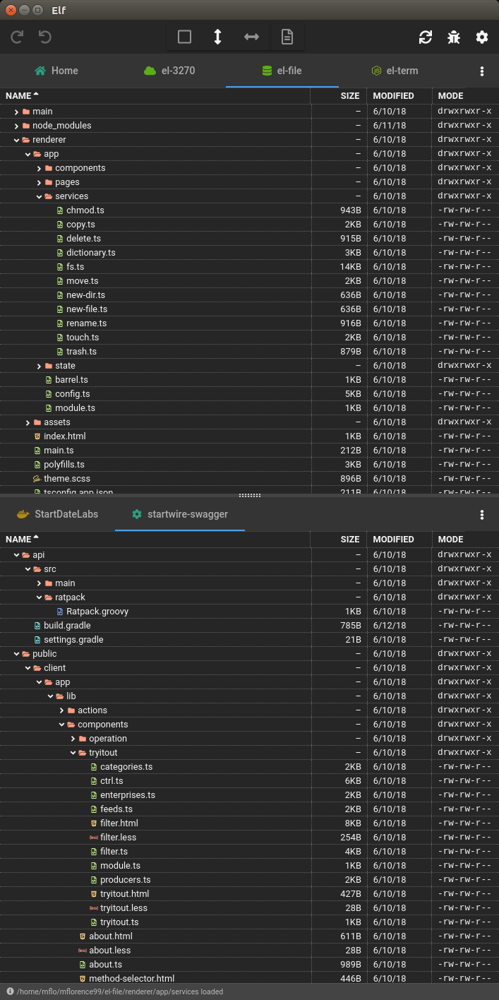
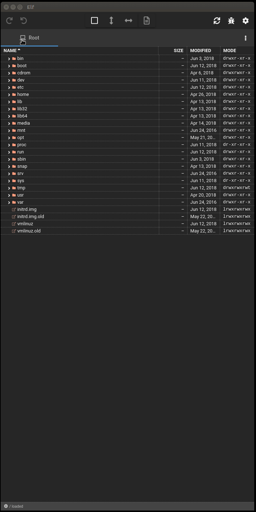

# Elf

I've been building a small suite (see [_El terminador_](https://github.com/mflorence99/el-term) for instance) of Electron-based apps. The _Elf_ file manager is the latest. My motivation throughout has partly been that few Linux tools have the kind of rich UI you can build today with tools like Angular and Material Design. But they have also been adventures in immutable state management made joyous by the incredible [ngxs](https://ngxs.io) state management tooling. More on that later.

Secondarily, I tried about a dozen Ubuntu file managers and all left me frustrated. Even the simple capability of starting exactly where you left off last time was difficult to find. I sorely missed Cocoatech's excellent [Path Finder](https://cocoatech.com/#/) on my Mac.

<!-- toc -->

- [Highlights](#highlights)
- [Elf in Action](#elf-in-action)
- [Technology Stack](#technology-stack)
- [How to Run in Development Mode](#how-to-run-in-development-mode)
- [How to Run in Production Mode (Linux)](#how-to-run-in-production-mode-linux)
- [How to Run in Production Mode (Windows and Mac)](#how-to-run-in-production-mode-windows-and-mac)
- [Tips](#tips)
- [Remaining Tasks](#remaining-tasks)

<!-- tocstop -->

## Highlights



* Single-pane, or dual pane split either horizontally or vertically
* Any number of tabs per pane
* All customizations (splits, tabs and so on) are automatically persisted
* Effectively unlimited undo/redo stack
* Log of all actions performed

## Elf in Action



## Technology Stack

Elf was essentially made possible by [ngxs](https://ngxs.io). It is an amazing state management pattern and no Angular project should be started IMHO without at least considering it. The entire state of Elf -- from the clipboard through selection to the tab and view configuration -- is managed by `ngxs`. 

Best of all, so is the state of the file system. Elf sets file watchers for each open folder. Only the watchers mutate Elf's file system state. Actions like copy or move are not operations on a tree. Rather, they are operations on the underlying file system itself. The tree redraws itself in response to changes in its state.

As always, in addition to `ngxs`, I have relied heavily on one of the best tech stacks currently available:

* [Electron](https://electronjs.org/) to build a cross-platform desktop app with [TypeScript](http://www.typescriptlang.org/), HTML and CSS.
* [Angular](https://angular.io/docs) as a framework for SPAs.
* Thorsten Hans' [ngx-electron](https://github.com/ThorstenHans/ngx-electron) to expose Electron's API to Angular.
* The context menu is driven by the impressive [ngx-contextmenu](https://github.com/isaacplmann/ngx-contextmenu).
* [Angular Material](https://material.angular.io/) for UI components.
* [Font Awesome](https://fontawesome.com)'s awesome library of icons.
* [angular-split](https://bertrandg.github.io/angular-split/#/) handles all the details of the splits that Elf supports.
* [ngx-drag-drop](https://www.npmjs.com/package/ngx-drag-drop) supports file drag and drop operations and allows tabs to be reordered.

## How to Run in Development Mode

One time only, you'll need to grab the code.

```sh
git clone https://github.com/mflorence99/el-file.git
cd el-file
npm install
```

Next, start the dev server for the Angular client. This way, hot reload of the client is supported.

```sh
npm run serve
```

Finally, in another session, start the Electron app itself.

```sh
npm run test
```

## How to Run in Production Mode (Linux)

> NOTE: this currently only works for Ubuntu / Debian.

> I need to host the installation files.

One time only, you'll need to grab the code.

```sh
git clone https://github.com/mflorence99/el-file.git
cd el-file
npm install
```

Then package and install Elf.

```sh
npm run package
npm run deb64
npm run deb64-install
```

## How to Run in Production Mode (Windows and Mac)

Although there are currently no installation files except for Linux, you can still start ELf in production mode.

```sh
npm run live
```

## Tips

* Ctrl+click on a folder's arrow attempts to open all the folders in the sub-tree
* Right click on a tab's icon to customize the tab or remove it

